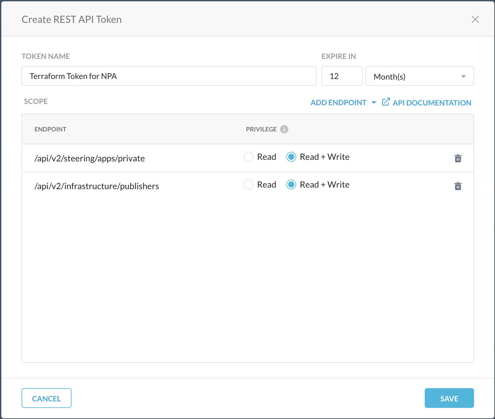

# Terraform Provider Netskope


## Requirements

-	[Terraform](https://www.terraform.io/downloads.html) >= 1.1.7
-	[Go](https://golang.org/doc/install) >= 1.17 


## Building The Provider - on Mac or Linux

1. Clone Netskope Provider Repo
1. Navigate to the Netskope Provider Dir
1. Compile the Netskope Provider

```sh
git clone https://github.com/netskopeoss/terraform-provider-netskope.git
cd terraform-provider-netskope
make install
```

## Building The Provider - on Windows

1. Clone Netskope Provider Repo
1. Navigate to the Netskope Provider Dir
1. Compile the Netskope Provider
1. Copy the Executable

```cmd
git clone https://github.com/netskopeoss/terraform-provider-netskope.git
cd terraform-provider-netskope
go build
xcopy terraform-provider-netskope.exe %AppData%\terraform.d\plugins\github.com\netskopeoss\netskope\0.1.0\windows_386\ /Y
```


## Using  The Provider
The Netskope Terraform Provider Repo includes sample plans to get you started. You will need to complete several task before launching any of the samples or to use the provider in your own plans.

### Netskope Tenant Tasks

1. Identify the "Base URL" for your Netskope tenant.
    - This will be the URL used to manage your Netskope tenant 
    - For example: `https://example.goskope.com`

1. Follow the [REST APIv2 Documentaion](https://docs.netskope.com/en/rest-api-v2-overview-312207.html) to create an API Token
    - Required "Read+Write" Endpoints For NPA:
        - `/api/v2/steering/private`
        - `/api/v2/infrastructure/publisher`
    


### Terraform Configuration

1. Setup Required Providers in TF file
    ```go
    terraform {
    required_providers {
        netskope = {
        version = "0.2.0"
        source  = "github.com/netskopeoss/netskope"
        }
    }
    }
    ```

1. Optionally configure Provider Block
    - Use of `NS_BaseURL` and `NS_ApiToken` Environment Variables are preferred
    ```go
    provider "netskope" {
        baseurl = "https://<tenant-url>.goskope.com"
        apitoken = "<api token>"
    }
    ```

1. Create a Publisher
    ```go
        resource "netskope_publishers" "Publisher" {
            name = "Example-Publisher"
        }
    ```

1. Create an Private Application
    ```go
        resource "netskope_privateapps" "PrivateApp" {
            app_name = "Eaxmple-Private-App"
            host     = "site1.example.internal, site2.example.internal"

            protocols {
                type = "tcp"
                port = "22, 443, 8080-8081"
            }

            protocols {
                type = "udp"
                port = "194"
            }

            publisher {
                publisher_id   = netskope_publishers.Publisher.id
                publisher_name = netskope_publishers.Publisher.name
            }
        }
    ```


### Examples
 - [NPA Deployment in Netskope Tenant](./examples/npa/README.md)


### Modules using the Netskope Provider

- [Netskope Publisher in Amazon EC2](https://github.com/netskopeoss/terraform-netskope-publisher-aws)


